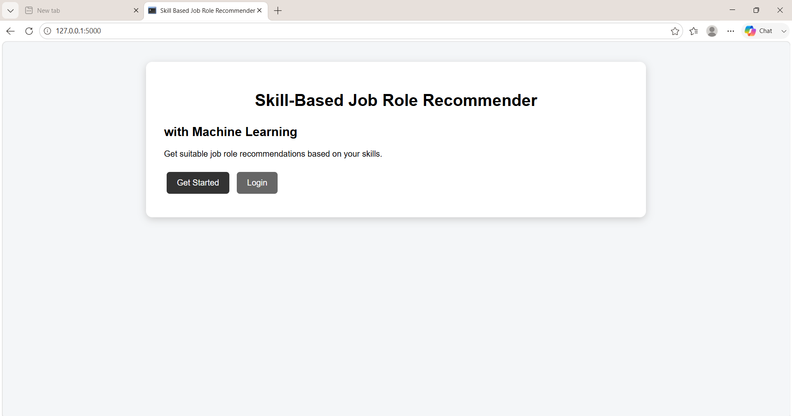
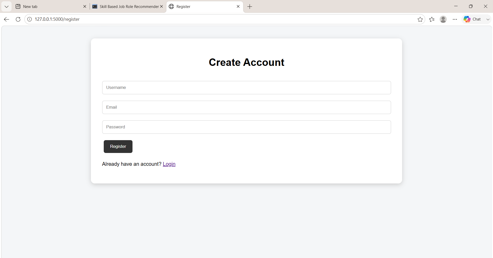
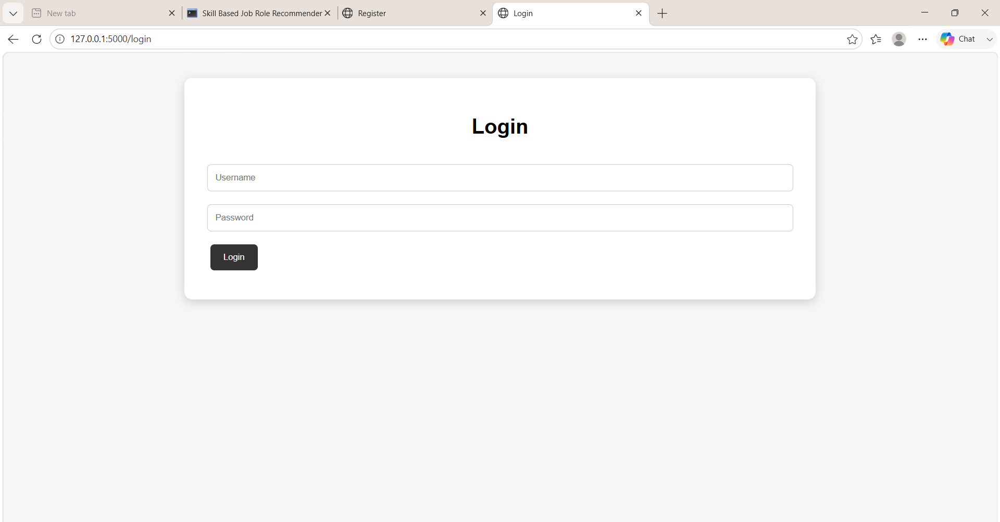
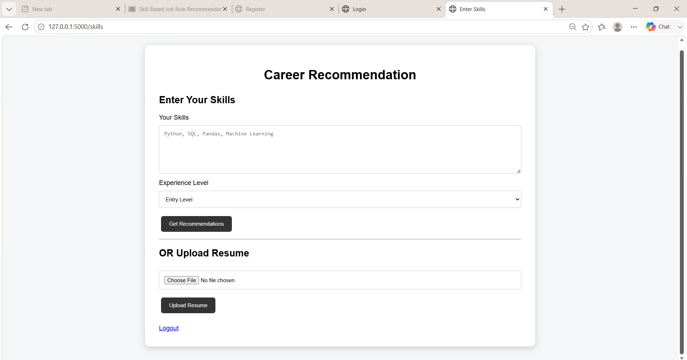
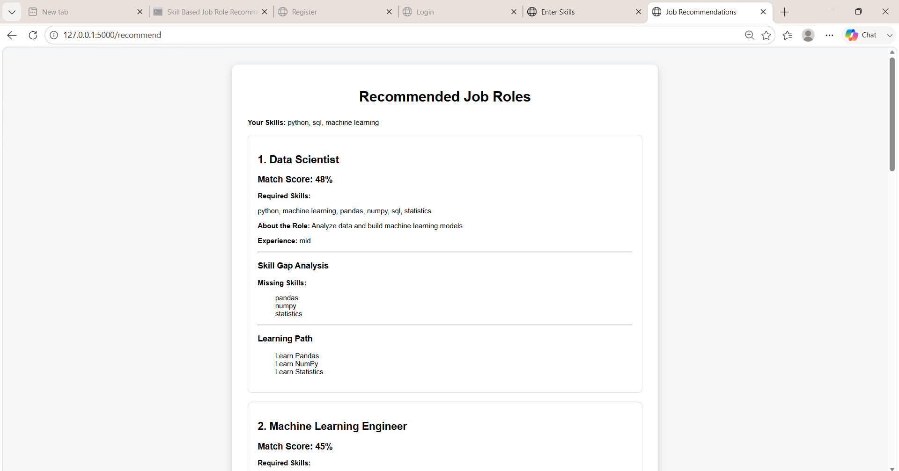
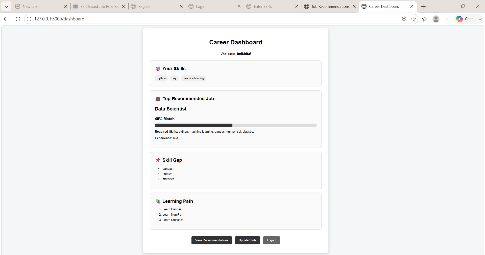

# Skill-Based Job Role Recommender with Machine Learning

## 📌 Project Overview

Skill-Based Job Role Recommender is a web application that recommends suitable job roles based on a user's skills or uploaded resume.

The system uses Machine Learning techniques to compare user skills with job role requirements and provides job recommendations, match scores, skill gap analysis, and a personalized learning path.

## 🎯 Features

* User Registration and Login
* Manual Skill Input
* Experience Level Selection
* Resume Upload
* PDF and DOCX Resume Text Extraction
* Automatic Skill Extraction
* Machine Learning Job Recommendation
* Sentence-BERT based similarity
* TF-IDF fallback
* Cosine Similarity
* Match Score
* Skill Gap Analysis
* Personalized Learning Path
* Career Dashboard
* Logout

## 🛠️ Technologies Used

### Frontend

* HTML
* CSS
* JavaScript

### Backend

* Python
* Flask

### Machine Learning

* Scikit-learn
* TF-IDF
* Sentence-BERT
* Cosine Similarity
* NumPy
* Pandas

### Resume Processing

* PyPDF2
* python-docx

### Data Storage

* JSON

## 🔄 Project Workflow

```text
User Registration/Login
        ↓
Enter Skills OR Upload Resume
        ↓
Resume Text Extraction
        ↓
Skill Extraction
        ↓
Machine Learning Model
        ↓
Cosine Similarity
        ↓
Job Role Ranking
        ↓
Match Score
        ↓
Skill Gap Analysis
        ↓
Learning Path
        ↓
Career Dashboard
```

## 💼 Recommended Job Roles

* Data Scientist
* Python Developer
* Data Analyst
* Full Stack Developer
* Machine Learning Engineer

## 📂 Project Structure

```text
Skill-Based Job Role Recommender/
│
├── app.py
├── backend.py
├── user_management.py
├── users.json
├── requirements.txt
├── README.md
├── .gitignore
│
├── templates/
│   ├── index.html
│   ├── register.html
│   ├── login.html
│   ├── skills.html
│   ├── recommend.html
│   └── dashboard.html
│
└── static/
    ├── css/
    │   └── style.css
    ├── js/
    └── images/
```

## 🚀 How to Run

### 1. Clone the repository

```bash
git clone https://github.com/Nikhita125/skill-based-job-role-recommender.git
```

### 2. Open the project

```bash
cd skill-based-job-role-recommender
```

### 3. Create a virtual environment

```bash
python -m venv venv
```

### 4. Activate the virtual environment

Windows:

```bash
venv\Scripts\activate
```

### 5. Install dependencies

```bash
pip install -r requirements.txt
```

### 6. Run the application

```bash
python app.py
```

### 7. Open in browser

```text
http://127.0.0.1:5000
```

## 🤖 Machine Learning

The system compares user skills with job-role requirements using vector representations and similarity techniques.

Sentence-BERT (`all-MiniLM-L6-v2`) is used to generate semantic embeddings when available.

Cosine similarity is then used to compare the user's skills with job-role requirements and rank suitable roles.

If Sentence-BERT is unavailable, the system automatically uses TF-IDF as a fallback.

## 🔍 Skill Gap Analysis

The system identifies skills required for the recommended job role that are missing from the user's current skill set.

## 📚 Learning Path

Based on the missing skills, the system generates a simple learning path to help the user improve their skills for the recommended role.

## 🔮 Future Enhancements

* Larger real-world job dataset
* More job roles
* Job vacancy API integration
* Advanced resume parsing
* Skill ontology
* ANN-based faster similarity search
* Personalized course recommendations
* Cloud deployment
* Mobile application

## 👨‍💻 Project Type

B.Tech Computer Science and Engineering Project

## 📜 License

This project is developed for educational and academic purposes.

## 📸 Project Screenshots

### 🏠 Home Page


### 📝 Register Page


### 🔐 Login Page


### 🛠️ Skills & Resume Upload


### 💼 Job Recommendations


### 📊 Career Dashboard



